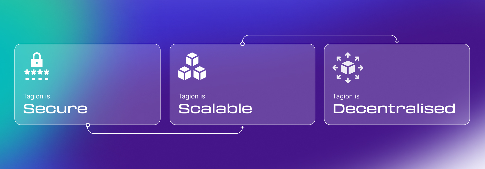

# Get Involved
Tagion is a fully decentralised monetary system, meaning it is secure, scalable and decentralised. The jist of it is a unique approach to governance and that we have been able to create a decentralised network with hashgraph as the consensus mechanism. Further, as exact ordering is a given, all sorts of asset trading is well supported through the future DEX.

# Links
📜 Take a look at our techpaper describing the core technology that tagion is built upon. [Tech-Paper (PDF)](https://tagion.org/resources/tech-paper.pdf). [Tech-Paper (github)](https://github.com/tagion/docs-paper).

💬 Chat and ask questions on the [Official Discord](https://discord.gg/k7Rqmu78PZ).

